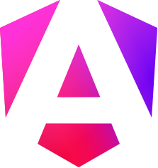
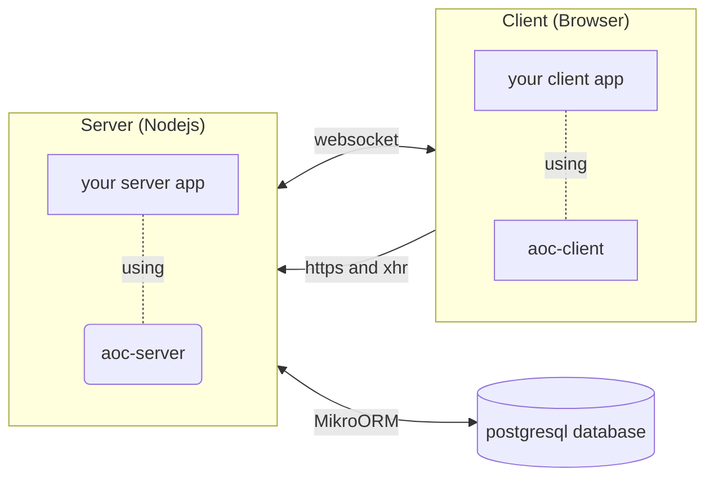

<table align="center">
  <tr>
    <td>Use the <a href="https://github.com/atlantis-of-code/aoc/issues">Issues</a> page to fill a bug report or feature request</td>
    <td>Use the  <a href="https://github.com/atlantis-of-code/aoc/discussions">Discussions</a> page to ask questions or look for help</td>
  </tr>
</table>

---

  

<h1 align="center">
The AOC Framework
</h1>

**Develop ERP-style applications in TypeScript**

<!--  -->

**The AOC framework** provides you with the tools you need to quickly and reliably develop management applications 
(e.g. **ERP-style applications**, or internal business management applications) that are used over a web browser. 
It provides a compendium of components, classes, utilities, functions, workflows that will allow you to focus 
on the fundamental aspects of your application, such as data processing, database definition, that make your 
application unique, without having to spend time on tasks such as creating user interfaces, writing stylesheets, 
html code, websockets, apis or cruds, as all this is provided by the framework.

The AOC framework is composed of two separate libraries: aoc-client and aoc-server.

* **aoc-client** is a library for [Angular](https://angular.io/) that provides components, directives, services, etc. 
that you will use to perform the front-end part of your application.
* **aoc-server** is a library for [Node.js](https://nodejs.org/) that takes care of the server-side part, 
defines endpoints and performs operations on the database.

In addition, the **aoc-cli** package is provided for you to generate code and run other tasks from the command line.

<table align="center" valign="middle">
  <tr>
    <td></td>
    <td></td>
    <td></td>
    <td></td>
    <td></td>
  </tr>
</table>

## Advantages

* 100% [Typescript](https://www.typescriptlang.org/), no language switching.
* No CSS, no complicated HTML structures, no SQL most of the time.
* Angular is fantastic, and the rest of the complicated stuff is already programmed by us in **aoc-client**.
* Node.js is fantastic, as it is extremely fast, versatile and has a very large 
ecosystem. **aoc-server** uses [Express](https://expressjs.com/) under the hood. You can expand with your own routers and extra functionality.
* Very fast and reliable ORM called [MikroORM](https://mikro-orm.io/). Also Typescript.
* Written to work with [PostgreSQL](https://www.postgresql.org/) only, 
at this time. We consider it the best open source database engine available.
* **Proven effectiveness: Applications made with this framework are used in companies of various sectors 
and public institutions.**

## Please note

* In this framework, many decisions have been made by us for you.
* You need to understand how Angular works, at least at a basic or intermediate level. 
* You need to understand some MikroORM, relational databases and SQL concepts.

## Diagram of parts

This diagram quickly shows the parts and the communication between them at a general level.

When a user connects to your application, they will be served the front-end part, that is, an Angular SPA. 
From there, the client will make requests to the back-end as needed, and will receive the 
relevant updates via websocket (for example, when it needs to refresh a list of articles because another user has 
added an article). And ultimately, SQL statements will be executed on top of PostgreSQL to interact with the data.

There are some more benefits to be aware of:

* Use of websockets (socket.io) to notify connected clients that there are updates.
* Possibility of creating a cluster of nodes automatically, you write the program for one node, and it can run in several.
* Provides a mechanism for creating the critical section (mutex) for those cases where you need to do a 
task and make sure there might be a race condition.
* An extensible translation system.
* Automatic creation of all data models (on the client we call them models, and on the server we call them entities) 
from an introspection of your database design.
* Many of data relation patterns are solved at both client and server side (if you find one that is not supported, 
let us know).
* Generation of automatic APIs (Cruds, for example).
* A reporting system in HTML and PDF.
* A spreadsheet system to create XLS files from data.
* Server-side hooks for api calls and ORM.
* Write client-side queries as if you were developing on the server side.
* Write custom authentication (log-in) and authorization (permissions) of users.
* Themable UI, give your application corporate colors by adjusting a couple of variables, the rest will be autocalculated. 
* And much more that you will discover...

In the diagram certain parts have been omitted for the sake of simplicity, for example, in a real environment, 
you might want to use an nginx or haproxy reverse proxy, a docker container system, make a round robin between nodes, 
a pool of connections like PgBouncer...
For all this and more you will find guides and tutorials in our documentation.

## See it in action

<table align="center">
  <tr>
    <td>
      
    </td>
  </tr>
  <tr>
    <td>
<a href="https://quest.aoc-dev.io"><strong>Quest for Atlantis</strong></a>
</td>
  </tr>
</table>

The «Quest for Atlantis» is a tiny ERP application designed for demonstration purposes, allowing you to explore its [source code](https://github.com/atlantis-of-code/quest).
In addition to framework's documentation and API, it serves as an extremely valuable and up-to-date resource for learning.

## Frequently Asked Questions

**Q:** What kind of applications can I create? \
**A:** The AOC framework was developed with the idea to facilitate the process to create all sorts of business 
management software. It fits perfectly well for the spectre of **ERP applications**. Financial accounting, 
management accounting, order processing, customer/supplier relationship management, and data services are common areas 
a software could cover. It allows the developers to reflect vendor's interpretation of the most effective way 
to perform each business process. 

**Q:** What are the available deployment options? \
**A:** You are free to use any option like on-premises, cloud hosted, or SaaS.
 
**Q:** What are the best ways to learn this framework? \
**A:** It is recommended to read the Documentation, and check the Quest Demo application.

**Q:** Can I use aoc-client/aoc-server one without the other? \
**A:** Yes, in fact, it would make sense to use aoc-server in case you need the API endpoints and use a different 
front end, for example.

**Q:** Do I need to pay to use this framework, build an application, and sell it to my customers? \
**A:** If you make a commercial usage, yes. Check our prices in [our website](https://aoc-dev.io)

## npm Packages
* **@atlantis-of-code/aoc-client**
* **@atlantis-of-code/aoc-server**
* **@atlantis-of-code/aoc-cli**
